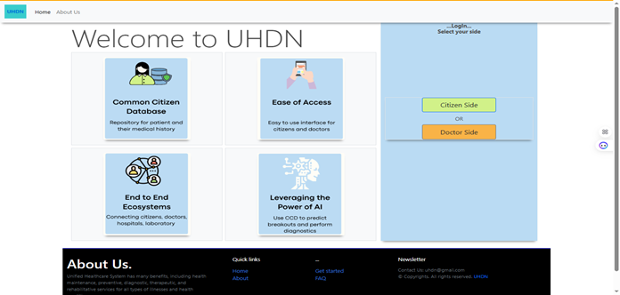

# 🏥 Unified Healthcare Data Network (UHDN)



## 📋 Overview

The Unified Healthcare Data Network (UHDN) is a comprehensive healthcare management system that combines patient data management with advanced AI-powered medical diagnosis capabilities. This platform provides healthcare professionals and patients with a unified interface for managing medical records, uploading documents, and leveraging machine learning models for early detection of various medical conditions.

## ✨ Key Features

### 🔐 Authentication & User Management
- **Multi-role Authentication**: Separate login systems for patients and doctors
- **Secure Registration**: User registration with password confirmation
- **Session Management**: Secure session handling with Flask sessions

### 📊 Patient Dashboard
- **Medical Records Management**: Upload and manage patient documents
- **File Upload System**: Support for various medical document formats
- **Patient History Tracking**: Comprehensive medical history management
- **Doctor/Hospital Search**: Find healthcare providers in your area

### 🧠 AI-Powered Medical Diagnosis
Advanced machine learning models for medical image analysis:

#### Brain Tumor Detection
- **Technology**: Deep Learning CNN models
- **Input**: Brain MRI scans
- **Output**: Tumor detection and classification
- **Location**: `Advance Detection and Diagnosis/brain tumor/`

#### COVID-19 Detection
- **Technology**: Computer Vision models
- **Input**: Chest X-ray images
- **Output**: COVID-19 detection from radiological images
- **Location**: `Advance Detection and Diagnosis/covid/`

#### Pneumonia Detection
- **Technology**: Medical image classification
- **Input**: Chest X-ray images
- **Output**: Pneumonia detection and severity assessment
- **Location**: `Advance Detection and Diagnosis/pneumonia/`

## 🛠️ Technology Stack

### Backend
- **Framework**: Flask (Python)
- **Database**: MySQL with Flask-MySQLdb
- **Authentication**: Flask sessions with secure key management
- **File Handling**: Werkzeug for secure file uploads

### Frontend
- **Styling**: Bootstrap for responsive design
- **Templates**: Jinja2 templating engine
- **UI Components**: Custom CSS with modern healthcare-focused design

### Machine Learning
- **Deep Learning**: TensorFlow/Keras models
- **Image Processing**: OpenCV and PIL
- **Model Architecture**: Convolutional Neural Networks (CNNs)

## 🚀 Installation & Setup

### Prerequisites
- Python 3.8+
- MySQL Server
- Virtual Environment (recommended)

### 1. Clone the Repository
```bash
git clone https://github.com/gowtham6477/Unified-Healthcare-data-network.git
cd Unified-Healthcare-data-network
```

### 2. Set Up Virtual Environment
```bash
# Create virtual environment
python -m venv myvenv

# Activate virtual environment
# On Windows:
myvenv\Scripts\activate
# On macOS/Linux:
source myvenv/bin/activate
```

### 3. Install Dependencies
```bash
pip install flask flask-bootstrap flask-mysqldb tensorflow opencv-python pillow werkzeug
```

### 4. Database Configuration
```sql
-- Create database
CREATE DATABASE restaurant;

-- Create users table
CREATE TABLE users (
    id INT AUTO_INCREMENT PRIMARY KEY,
    location VARCHAR(100),
    name VARCHAR(100),
    username VARCHAR(100) UNIQUE,
    password VARCHAR(100)
);
```

### 5. Update Configuration
Edit the MySQL configuration in `app.py`:
```python
app.config['MYSQL_HOST'] = 'localhost'
app.config['MYSQL_USER'] = 'your_username'
app.config['MYSQL_PASSWORD'] = 'your_password'
app.config['MYSQL_DB'] = 'restaurant'
```

### 6. Run the Application
```bash
python app.py
```

The application will be available at `http://localhost:5001`

## 📁 Project Structure

```
Unified-Healthcare-data-network/
├── app.py                          # Main Flask application
├── auth.py                         # Authentication utilities
├── database1.db                    # SQLite database (backup)
├── uploads/                        # User uploaded files
├── static/                         # Static assets (CSS, images)
├── templates/                      # HTML templates
│   ├── index.html                 # Landing page
│   ├── dashboard.html             # Patient dashboard
│   ├── dashboard2.html            # Doctor dashboard
│   ├── login.html                 # Patient login
│   ├── loginDoc.html              # Doctor login
│   └── ...
├── Advance Detection and Diagnosis/
│   ├── brain tumor/               # Brain tumor detection module
│   │   ├── app.py                # Brain tumor Flask app
│   │   ├── brain_tumor.py        # ML model implementation
│   │   └── weights/              # Trained model weights
│   ├── covid/                     # COVID-19 detection module
│   │   ├── app.py                # COVID Flask app
│   │   ├── covid.py              # ML model implementation
│   │   └── weights/              # Trained model weights
│   └── pneumonia/                 # Pneumonia detection module
│       ├── app.py                # Pneumonia Flask app
│       ├── pneumonia.py          # ML model implementation
│       └── weights/              # Trained model weights
└── Test Images/                   # Sample medical images for testing
```

## 🔧 Usage

### For Patients
1. **Register**: Create a new patient account
2. **Login**: Access your personal dashboard
3. **Upload Documents**: Add medical reports, prescriptions, and test results
4. **View History**: Access your complete medical history
5. **Search Providers**: Find doctors and hospitals in your area

### For Healthcare Providers
1. **Doctor Login**: Access the healthcare provider dashboard
2. **Patient Management**: View and manage patient records
3. **AI Diagnosis**: Use advanced detection tools for medical imaging
4. **Report Generation**: Create and manage medical reports

### AI Diagnosis Tools
Each detection module can be run independently:

```bash
# Brain Tumor Detection
cd "Advance Detection and Diagnosis/brain tumor"
python app.py

# COVID-19 Detection
cd "Advance Detection and Diagnosis/covid"
python app.py

# Pneumonia Detection
cd "Advance Detection and Diagnosis/pneumonia"
python app.py
```

## 🧪 Testing

The `Test Images/` directory contains sample medical images for testing the AI diagnosis features:
- Brain MRI scans for tumor detection
- Chest X-rays for COVID-19 and pneumonia detection

## 🤝 Contributing

1. Fork the repository
2. Create a feature branch (`git checkout -b feature/AmazingFeature`)
3. Commit your changes (`git commit -m 'Add some AmazingFeature'`)
4. Push to the branch (`git push origin feature/AmazingFeature`)
5. Open a Pull Request

## 📄 License

This project is licensed under the MIT License - see the [LICENSE](LICENSE) file for details.

## 🙏 Acknowledgments

- Healthcare professionals who provided domain expertise
- Open-source medical imaging datasets used for model training
- Flask and TensorFlow communities for excellent documentation
- Contributors and testers who helped improve the system

## 📞 Support

For support and questions:
- Create an issue on GitHub
- Contact: [gowtham6477](https://github.com/gowtham6477)

---

**⚠️ Medical Disclaimer**: This system is for educational and research purposes. Always consult with qualified healthcare professionals for medical diagnosis and treatment decisions.